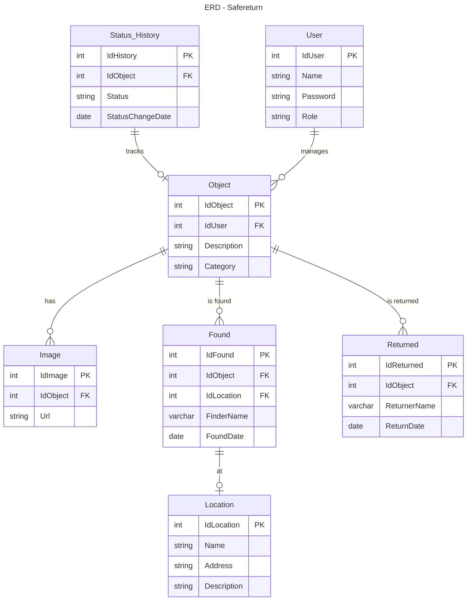

# ERD - Safereturn

```mermaid
---
title: ERD - Safereturn
---
erDiagram
    Object {
        int IdObject PK
        int IdUser FK
        string Description
        string Category
    }

    Image {
        int IdImage PK
        int IdObject FK
        string Url
    }

    Location {
        int IdLocation PK
        string Name
        string Address
        string Description
    }

    Found {
        int IdFound PK
        int IdObject FK
        int IdLocation FK
        varchar FinderName
        date FoundDate
    }

    Returned {
        int IdReturned PK
        int IdObject FK
        varchar ReturnerName
        date ReturnDate
    }

    Status_History {
        int IdHistory PK
        int IdObject FK
        string Status
        date StatusChangeDate
    }

    User {
        int IdUser PK
        string Name
        string Password
        string Role
    }

    %% Relationships
    Object ||--o{ Image: "has"
    Object ||--o{ Found: "is found"
    Object ||--o{ Returned: "is returned"
    Found ||--o| Location: "at"
    Status_History ||--o| Object: "tracks"
    User ||--o{ Object: "manages"
```
